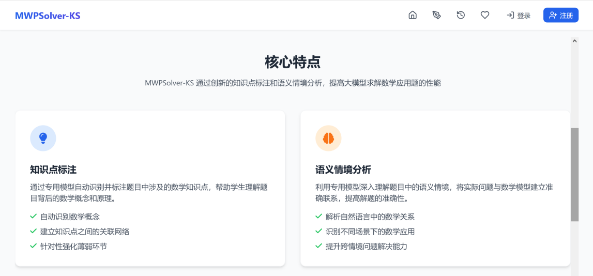

## CM13K_KP&SS 
<div align="center" style="padding-bottom: 20px">
  
</div>

## CM17K_KP & CM5K_SS
<div align="center" style="padding-bottom: 20px">
  
</div>

## MWPSolver-KS_WEB
<div align="center" style="padding-bottom: 20px">
  
</div>

An enhanced LLM-powered math word problem solving system (frontend web application).

MWPSolver-KS performs structured understanding of math word problems through two dedicated models—knowledge point labeling and semantic context analysis—then combines them with large language models to solve problems and generate explanations. It is suitable for teaching assistance, practice analysis, and similar scenarios.

---

### Feature Overview

- **Intelligent Solving Workflow**
  - After a problem is entered, the system first invokes the knowledge point recognition model and semantic context recognition model to understand the mathematical concepts and application scenarios involved.
  - Based on this analysis, an enhanced prompt is constructed to call the solving LLM, generating step-by-step reasoning and the final answer.
- **Knowledge Point Labeling**
  - Automatically extracts underlying mathematical knowledge points (e.g., algebra, geometry, probability).
  - Displayed as tags to help students understand the scope of knowledge involved in each problem.
- **Semantic Context Analysis**
  - Automatically identifies problem contexts (e.g., chicken-and-rabbit problems, work problems, travel problems).
  - Helps bridge the gap between real-world scenarios and mathematical models.
- **Solving Records & Favorites**
  - Automatically saves each solving session's problem, steps, and answer.
  - Supports viewing and managing records via "My Solving Records" and "My Favorites".
- **Admin Dashboard**
  - User management: add / edit / delete users, avatar management, admin password reset.
  - Solving LLM management: configure the list of solving models available on the frontend.
  - Knowledge point recognition model management: configure models used for knowledge point labeling.
  - Semantic context recognition model management: configure models used for semantic context recognition.
  - Solving record management and favorites management.
- **Frontend Tech Stack**
  - React 18 + TypeScript + React Router 7
  - Vite 6 build
  - Modern UI with Tailwind CSS styling (with custom styles)
  - `lucide-react` icons, `sonner` notifications, `recharts` data visualization (as needed)

---

### Tech Stack

- **Languages & Frameworks**
  - React 18
  - TypeScript
  - React Router DOM 7
- **Build Tools**
  - Vite 6
  - vite-tsconfig-paths (supports `@/` path aliases)
- **UI & Interaction**
  - Tailwind CSS (via `index.css` and utility classes)
  - lucide-react (icons)
  - framer-motion (animations, for motion effects)
  - sonner (global messages / Toast)
- **Content Display & Math Formulas**
  - react-markdown + remark-gfm (renders Markdown solutions from model output)
  - remark-math + rehype-katex + KaTeX (renders LaTeX math formulas in solutions)
- **Data & Validation**
  - zod (data structures and validation)
  - recharts (chart display, if statistical visualization is used)
- **Package Manager**
  - pnpm

---

### Directory Structure (Core)

Only the main directories closely related to business logic are listed for quick orientation:

```text
MathPro_Web/
├─ package.json          # Project dependencies and scripts
├─ vite.config.ts        # Vite configuration (do not modify)
├─ tsconfig.json         # TypeScript configuration (do not modify)
├─ src/
│  ├─ main.tsx           # Application entry, mounts to #root
│  ├─ App.tsx            # Route configuration (user + admin)
│  ├─ index.css          # Global styles (Tailwind-style integration)
│  ├─ components/
│  │  ├─ Layout.tsx      # User-side main layout (header, content area, etc.)
│  │  └─ ...             # Other reusable UI components
│  ├─ contexts/
│  │  └─ authContext.tsx # Auth context, manages user authentication state
│  ├─ lib/
│  │  ├─ api.ts          # Backend API wrapper, BASE_URL / getApiUrl / token, etc.
│  │  └─ utils.ts        # Common utility functions
│  ├─ services/          # API wrappers for backend interaction
│  │  ├─ auth.ts         # Login / register / token APIs
│  │  ├─ solve.ts        # Solving: model list, analysis, solving
│  │  ├─ records.ts      # Solving record list, details, save
│  │  ├─ favorites.ts   # Favorites add / delete / list
│  │  └─ admin.ts        # Admin APIs (users, model config, etc.)
│  ├─ pages/
│  │  ├─ user/           # User-side pages
│  │  │  ├─ Home.tsx             # Home: system intro + quick links + recent solves
│  │  │  ├─ ProblemInput.tsx     # Solving page: input problem, select LLM, view chat flow
│  │  │  ├─ ProblemResult.tsx    # Solving result detail: problem + steps + answer + tags
│  │  │  ├─ ProblemRecords.tsx   # Solving record list
│  │  │  ├─ MyFavorites.tsx      # Favorites list
│  │  │  ├─ MyPage.tsx           # Profile page (if implemented)
│  │  │  ├─ Login.tsx            # User login
│  │  │  └─ Register.tsx         # User registration
│  │  └─ admin/         # Admin dashboard pages
│  │     ├─ AdminLayout.tsx          # Admin layout (sidebar + main content)
│  │     ├─ AdminLogin.tsx           # Admin login
│  │     ├─ AdminUsers.tsx           # User management
│  │     ├─ AdminModels.tsx          # Solving LLM management + UniAPI config
│  │     ├─ AdminKnowledgeModels.tsx # Knowledge point recognition model management
│  │     ├─ AdminSemanticModels.tsx  # Semantic context recognition model management
│  │     ├─ AdminRecords.tsx         # Solving record management
│  │     ├─ AdminRecordResultModal.tsx # Record detail modal (admin view)
│  │     └─ AdminFavorites.tsx       # Favorites management
│  └─ types/
│     └─ problem.ts       # Problem / record type definitions
└─ ...
```

---

### Routes & Pages

#### User Routes (`/` prefix)

- `/`
  - Home page: system introduction, core features, quick links (solve / records / favorites), and recent solving records.
- `/problem-input` (login required)
  - Enter problem text, select a solving LLM, click "Start Solving".
  - The page displays a chat-like conversation flow:
    - User question
    - "Identifying knowledge points and semantic context" stage
    - Labeling results (knowledge points + semantic context)
    - "Solving" stage
    - Solution card (click "View Full Analysis" to go to the detail page)
- `/problem-result/:id` (login required)
  - Displays a single solving record detail:
    - Left: problem content + knowledge point tags + semantic context tags (sticky header supported)
    - Right: step-by-step solution + final answer area
    - Top: back, favorite / unfavorite, copy problem and solution, share button (placeholder)
- `/problem-records` (login required)
  - List view of the current user's solving records.
- `/my-favorites` (login required)
  - Lists the current user's favorited problem records; click to view details.
- `/mypage` (login required)
  - Profile page (basic info / stats depending on implementation).
- `/login`
  - User login page.
- `/register`
  - User registration page.

> Note: Protected user routes are implemented via the `ProtectedRoute` component in `App.tsx`, relying on `isAuthenticated` / `authReady` from `AuthContext`.

#### Admin Routes (`/admin` prefix)

- `/admin/login`
  - Admin login.
- `/admin` + sub-routes (all require admin token):
  - `/admin/users`
    - User management: list, search, pagination, edit, delete, add user.
    - Edit supports: nickname, avatar URL or upload, password reset.
  - `/admin/models`
    - Solving LLM management:
      - Top section: UniAPI configuration (Base URL, Token).
      - Bottom section: list of "solving LLMs" available on the frontend (model ID / display name / sort order / enabled status).
  - `/admin/knowledge-models`
    - Knowledge point recognition model list management (similar to `AdminModels`).
  - `/admin/semantic-models`
    - Semantic context recognition model list management.
  - `/admin/records`
    - Global solving record management: admins can view all users' records and open details in a modal.
  - `/admin/favorites`
    - Favorites management.

---

### API & Authentication (Frontend Perspective)

#### API Base Configuration

Defined in `src/lib/api.ts`:

- **Base URL**:
  - `BASE_URL = import.meta.env.VITE_API_BASE_URL ?? 'http://localhost:8000'`
- **Unified prefix**:
  - `API_PREFIX = '/api'`

Common wrapper methods:

- `apiGet(path, params?)`
- `apiPost(path, body)`
- `apiPatch(path, body)`
- `apiDelete(path, params?)`

> Example: `/api/solve/analyze`, `/api/solve/models`, `/api/records/list`, etc. are all built on this base.

#### Authentication

- The frontend stores the user token in `localStorage`:
  - Key: `mathpro_token` (see `AUTH_TOKEN_KEY`).
- Each request automatically includes in the Header:
  - `Authorization: Bearer <token>`
- `AuthProvider` + `AuthContext` are responsible for:
  - Reading the local token on app initialization and validating login state.
  - Providing `isAuthenticated` / `authReady` to the route guard `ProtectedRoute`.

---

### Environment Variables

Before running or building the project, configure via `.env` or environment variables:

- **`VITE_API_BASE_URL`** (recommended)
  - Type: string
  - Example: `http://localhost:8000` or your production backend URL
  - Purpose:
    - Determines the backend service address for all `/api/...` requests.
    - Affects full URL construction for static assets like avatars via `getAssetUrl`.

If not configured, defaults to `http://localhost:8000` as the backend address.

---

### Local Development

#### Prerequisites

- Install [Node.js](https://nodejs.org/en) (18+ recommended)
- Install [pnpm](https://pnpm.io/installation)

#### Install Dependencies

```sh
pnpm install
```

#### Start Development Server

```sh
# Shortcut
pnpm dev

# Equivalent to
pnpm dev:client
```

The frontend dev server starts at `http://localhost:3000` by default.

> Tip: Ensure the backend API service is also running at the address pointed to by `VITE_API_BASE_URL` (default `http://localhost:8000`). Otherwise, frontend requests for solving, login, etc. will fail.

---

### Build & Deployment

#### Build Frontend Static Assets

```sh
# Frontend only
pnpm build:client

# Or full build (includes auxiliary build artifacts)
pnpm build
```

- `pnpm build:client`:
  - Builds the frontend with Vite, output to `dist/static`.
- `pnpm build`:
  - Clears the `dist` directory.
  - Builds the frontend to `dist/static`.
  - Copies `package.json` to `dist`.
  - Creates `dist/build.flag` (can be used by backend or deploy scripts as a "built" marker).

#### Deployment Recommendations

- Serve the frontend build output `dist/static` as static assets, hosted by the backend or a static server (e.g., Nginx).
- All non-static routes (e.g., `/problem-input`, `/admin/users`) should fall back to `index.html` for frontend routing (React Router) to handle.
- Ensure the deployment environment sets the correct `VITE_API_BASE_URL` pointing to the backend API service.

---

### Solving Workflow (Business Perspective)

Example: a user initiates solving on the `/problem-input` page:

1. **User enters problem text** and selects a solving LLM (frontend fetches model list from `/api/solve/models`).
2. **Frontend calls the analysis API** (e.g., `/api/solve/analyze`):
   - Returns: `knowledge_points` (array), `semantic_contexts` (array).
   - Frontend displays these as tags in an "Recognition Results" card in the conversation flow.
3. **Frontend calls the solving API** (e.g., `/api/solve`):
   - Request body includes problem text + knowledge points / semantic contexts from the previous step.
   - Backend constructs an enhanced prompt based on the configured LLM and calls the model to solve the problem.
4. **Frontend displays the solution**:
   - Shown as a "Solution" card in the conversation flow (partial content; long solutions may have scroll areas or entry points).
5. **Auto-save solving record**:
   - Calls `/api/records/save` (wrapped in `recordSave`), saving problem, steps, knowledge points, semantic contexts, etc. to the database.
   - On success, returns a record ID; the user can click "View Full Analysis" to navigate to `/problem-result/:id` for the complete detail.

---

### Admin Configuration & Operations

- **UniAPI Configuration (Solving LLM API)**
  - Configure in the top card on the "Solving Model Management" page (`/admin/models`):
    - `API Base URL`: unified LLM API address (UniAPI service URL).
    - `API Token`: key required to access the LLM API.
  - After saving, the frontend calls `/api/admin/uniapi-config` and related endpoints to update backend config; usually effective without restarting the service.

- **Solving LLM List**
  - Table configuration on the same page below:
    - `Model ID`: LLM identifier for UniAPI / backend, e.g., `gpt-5.2`, `deepseek-v3`.
    - `Display Name`: name shown in the frontend dropdown.
    - `Sort Order`: lower numbers appear first.
    - `Enabled`: controls whether the model appears in the user-side dropdown.
  - If the database is empty, the frontend falls back to default models from environment variables (e.g., `UNIAPI_SOLVE_MODELS`) configured by the backend.

- **Knowledge Point / Semantic Context Model Lists**
  - Corresponding pages `/admin/knowledge-models`, `/admin/semantic-models`:
    - Configure different dedicated recognition models for replacement or A/B testing.

- **User Management**
  - Admins on `/admin/users` can:
    - Create new users (username + password).
    - Upload / update user avatars.
    - Reset user passwords.
    - Delete users (solving records are typically retained but no longer linked).

---

### FAQ

- **Q: Frontend shows API errors or blank page after startup?**
  A:
  1. Confirm the backend API service is running.
  2. Confirm `VITE_API_BASE_URL` is set correctly in local or deployment environment.
  3. Check browser DevTools network tab to verify requests point to the correct address.

- **Q: Login state lost?**
  A:
  1. The frontend stores the token in `localStorage`; clearing browser storage requires re-login.
  2. If the backend invalidates the token (expiry / manual logout), re-login is also required.

- **Q: How to deploy after building?**
  A:
  1. Run `pnpm build`.
  2. Use `dist/static` as the frontend static directory.
  3. Configure the server to fall back all unmatched routes to `index.html` for frontend routing.

---

### Acknowledgments

- Thanks to the open-source community for excellent tooling (React, Vite, TypeScript, Tailwind, lucide-react, sonner, etc.).
